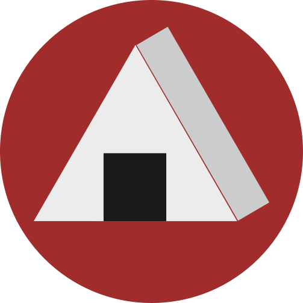

# onigiri

[](https://travis-ci.org/masahiko-ofgp/onigiri)



onigiri is the tool of handling `chars` in Rust.
The japanese name of rice ball is "Onigiri". 
In my image, a grain of rice is `char`. 
And what collected them is `chars`. 

##### Feb 25 2019

Removed `tools/create_vvchar`.

Renamed `validator/is_symbol` -> `validator/is_punctuation`

Modified DocComment and DocTest.

##### Dec 24 2018

Removed what seems useless from `tools.rs`.

Then I renamed `is_number`, `is_positive_number`, `is_negative_number` to `is_integer`, `is_positive_integer`, `is_negative_integer`.

Accordingly, I added `is_float`, `is_positive_float` and `is_negative_float` newly.

Renamed `create_btm` to `to_btm`.

##### Dec 9 2018

Vvc make it possible to specify a separator.

##### Nov 5 2018

Added new function `search_all`.


## Usage

You add onigiri in Cargo.toml.

```
[dependencies]
onigiri = "0.1.12"
```
example is as follows.

```
use onigiri::tools::{Vvc, cast};
use onigiri::validator;

fn main() {
    let test_text = "(13 + 2)".to_string();
    
    let new_vvchar = Vvc::new(&test_text, ' ');
    assert_eq!(
        &new_vvchar,
        &vec![vec!['(', '1','3'],vec!['+'],vec!['2', ')']]
    );
    
    let thirteen = &new_vvchar[0][1..].to_vec();
    assert_eq!(validator::is_positive_integer(&thirteen), true);
   
    let num = cast::<u8>(&thirteen);
    assert_eq!(&num, &Some(13_u8));
    assert_eq!(&num.unwrap() + 2, 15_u8);
}
```
